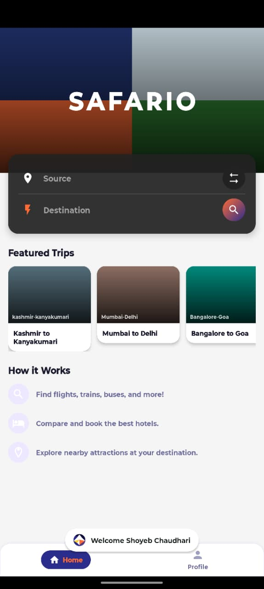
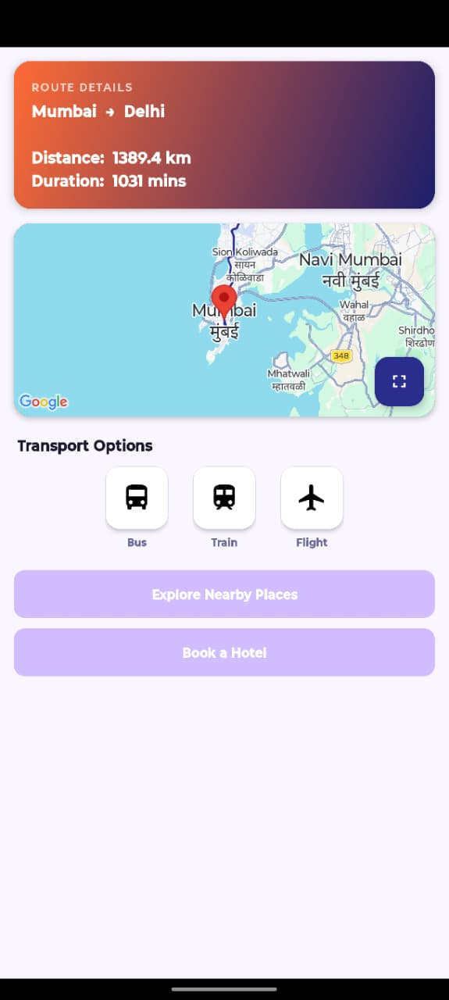
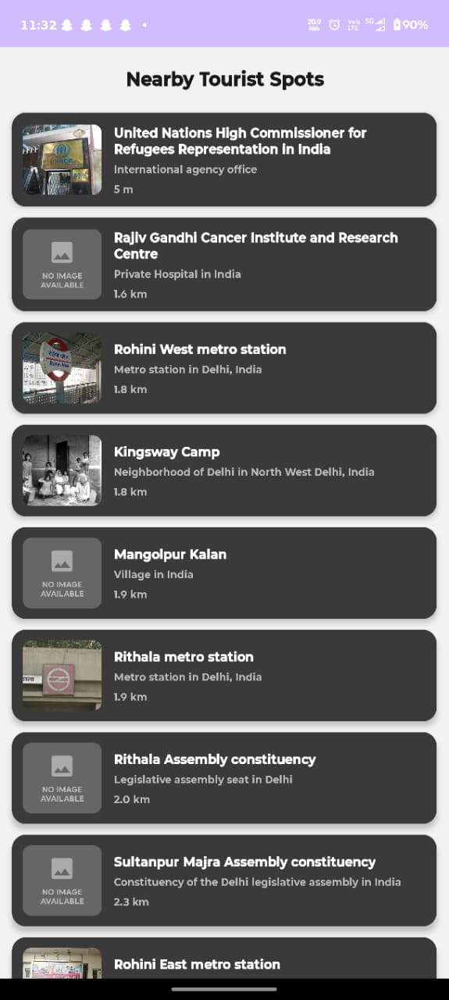
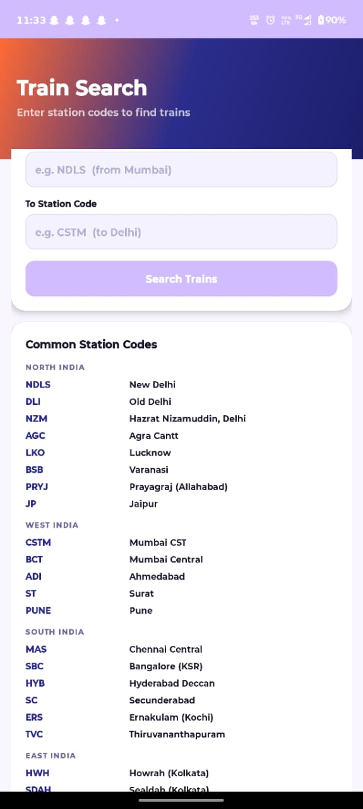
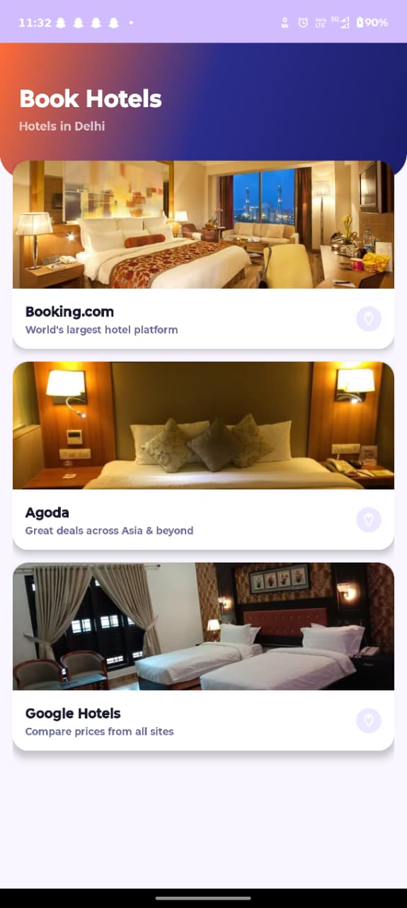
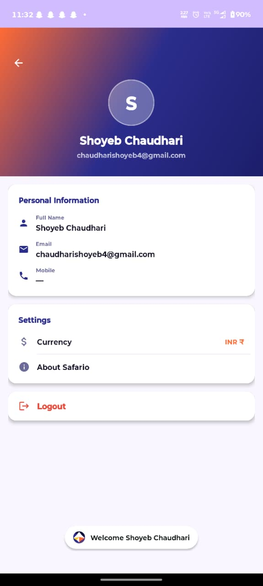

# Safario — Trip Planner

A modern Android travel planning app that helps users search routes, compare transport options, book hotels, and explore nearby attractions.

## Screenshots

| Splash | Trip Search | Route Details | Nearby Places |
|---|---|---|---|
|  |  |  |  |

| Train Search | Hotel Booking | User Profile |
|---|---|---|
|  |  |  |

---

## Features

- **Firebase Authentication** — Secure login and signup with email & password
- **Smart Route Search** — Autocomplete-powered source/destination input with swap support
- **Route Calculation** — Distance and duration via OSRM (Open Source Routing Machine)
- **Interactive Maps** — Google Maps integration with Normal, Satellite, Terrain, and Hybrid views
- **Transport Options** — Quick redirect to RedBus (bus), IRCTC (train), and Google Flights
- **Hotel Booking** — Compare stays on Booking.com, Agoda, and Google Hotels
- **Nearby Places** — Explore attractions around your destination (coming soon)

---

## Tech Stack

| Layer | Technology |
|---|---|
| Language | Java |
| Min SDK | 24 (Android 7.0) |
| Target SDK | 34 |
| UI | Material Design 3 |
| Auth | Firebase Authentication |
| Database | Firebase Firestore |
| Maps | Google Maps SDK + Places API |
| Routing | OSRM API |
| Networking | Retrofit 2 + Volley |
| Train Data | IRCTC API (RapidAPI) |

---

## Screens

| Screen | Description |
|---|---|
| Splash | Animated brand screen with logo and tagline |
| Login | Email/password sign-in with gradient hero card layout |
| Sign Up | New account registration (name, mobile, email, password) |
| Search | Trip origin/destination input with transport category tiles |
| Route | Route info card, mini map, transport chips, action buttons |
| Full Map | Full-screen map with switchable map type pill bar |
| Hotel Booking | Booking.com, Agoda, Google Hotels cards |
| Nearby Places | Attractions around destination (in development) |
| Transport Details | Train schedule via IRCTC API (in development) |

---

## UI Design

- **Primary color:** Deep Indigo Blue `#1A237E`
- **Secondary color:** Vivid Teal `#00BCD4`
- **Theme:** Material 3 DayNight with custom token system
- **Style:** Gradient hero headers, floating white cards, rounded inputs, icon-chip transport items

---

## Setup

1. Clone the repo
2. Open in Android Studio
3. Add your `google-services.json` to `app/`
4. Set your Google Maps API key in `AndroidManifest.xml`
5. Build and run on an Android device or emulator (API 24+)

---

## Project Structure

```
app/src/main/
├── java/com/example/travel_panner_project/
│   ├── MainActivity.java          # Splash screen
│   ├── LoginActivity.java         # Firebase login
│   ├── SignupActivity.java        # Firebase registration
│   ├── SearchActivity.java        # Trip search
│   ├── RouteActivity.java         # Route display
│   ├── MapsActivity.java          # Full-screen map
│   ├── HotelBookingActivity.java  # Hotel aggregator
│   ├── NearbyPlacesActivity.java  # Nearby attractions
│   ├── TransportDetailsActivity.java  # Train schedules
│   └── TransportRedirect.java     # Bus/flight redirects
└── res/
    ├── layout/                    # All screen layouts
    ├── drawable/                  # Icons, gradients, shapes
    └── values/                    # Colors, themes, strings
```

---

## Developer

**Shoyeb Chaudhari** — [GitHub](https://github.com/ShoyebChaudhari45)
